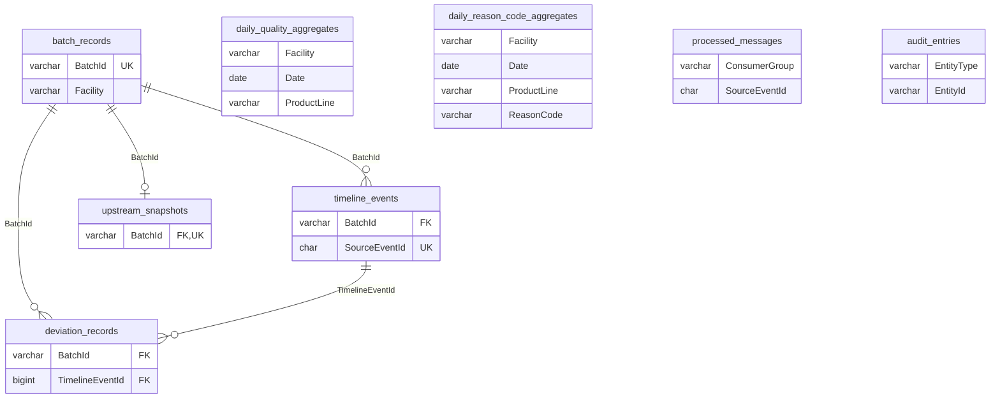

# Traceability Service: Database schema

What the Traceability database holds, table by table: columns, keys, the indexes and the queries they serve, the values stored in each coded column, and the sample data (SCRUM-120). Where the database is hosted, how to connect, the migration workflow and backups are in [database.md](database.md) (SCRUM-122).

---

## 1. Overview

Traceability Service keeps a **read model**: a copy of every batch's history, built from the other services' Kafka events and from lookups to the MCC and Intake Service. The trace and dashboard queries are answered from these tables alone, without calling the services that own the data.

| Table | One row per | Purpose |
|---|---|---|
| `batch_records` | Batch | The batch itself: status, product line, facility, how complete its trace is |
| `timeline_events` | Upstream event applied to a batch | The batch's history, in the order things happened |
| `upstream_snapshots` | Batch | What the MCC and Intake Service knows about the batch's dispatch: the dispatch note, tanks and consignments |
| `deviation_records` | Limit broken | What went out of range, by how much, and which event reported it |
| `daily_quality_aggregates` | Facility, production day and product line | Pre-counted batches by status |
| `daily_reason_code_aggregates` | Facility, production day, product line and reason code | Pre-counted deviations by reason |
| `processed_messages` | Event handled by a consumer group | Stops an event redelivered by Kafka being applied twice |
| `audit_entries` | Change made by a user or a consumer | Who changed what, and when |



The two aggregate tables, `processed_messages` and `audit_entries` have no foreign keys.

---

## 2. Conventions

| Convention | Detail |
|---|---|
| Business key | `BatchId` (the batch code, e.g. `262-FM-B`) is `varchar(50)` everywhere. It is an alternate key on `batch_records`, and the child tables' foreign keys point at it rather than at `Id` |
| Facility | `varchar(50)`, the same value as the token's `facility` claim, e.g. `FACTORY-01`. Every dashboard query filters on it, so it leads the indexes those queries use |
| Coded columns | Enums (`Status`, `Completeness`, `Checkpoint`, `ResolutionStatus`) are stored as the C# member name in a `varchar`, e.g. `Failed`, not `5`. The match is exact: `Mcc`, not `MCC` |
| Open-ended codes | `EventType`, `ProductLine` and `ReasonCode` are plain strings, so a new upstream event type, product line or reason needs no migration |
| Readings | `decimal(5,2)`: stored exactly, so 3.85 is 3.85 and not the nearest binary fraction |
| Timestamps | `datetime(6)`, in UTC |
| JSON | MySQL `json` columns hold payloads; read fields with `Payload->>'$.temperatureC'` |
| Event IDs | `char(36)` GUIDs, the upstream `EventId` |
| Surrogate keys | `int` auto-increment; `bigint` for the tables that grow with every event (`timeline_events`, `processed_messages`, `audit_entries`) |
| Names | Tables `snake_case` and plural; columns `PascalCase`, matching the entity properties |

`deviation_records.Limit` is a reserved word in MySQL. EF quotes it; hand-written SQL must too: `` `Limit` ``.

Each table has an entity in `src/TraceabilityService/Domain/Entities` and its mapping in `src/TraceabilityService/Infrastructure/Persistence/Configurations`.

---

## 3. Tables

Null = the column accepts `NULL`. Every `Id` is the primary key.

### `batch_records`

| Column | Type | Null | Notes |
|---|---|---|---|
| `Id` | `int` | | Auto-increment |
| `BatchId` | `varchar(50)` | | Batch code `[day]-[product]-[set]`, e.g. `262-FM-B`. Unique |
| `DispatchRef` | `varchar(50)` | Yes | MCC dispatch number, e.g. `DN-20260919-02`. Null until an event that carries it arrives |
| `ProductLine` | `varchar(10)` | | Product code from the batch code. See [Product lines](#product-lines) |
| `Facility` | `varchar(50)` | | The factory the batch was made at, e.g. `FACTORY-01` |
| `Status` | `varchar(20)` | | See [Batch status](#batch-status) |
| `Completeness` | `varchar(20)` | | `Partial` or `Complete`. See [Completeness](#completeness) |
| `FirstEventAt` | `datetime(6)` | | Earliest `OccurredAt` among the batch's events |
| `LastEventAt` | `datetime(6)` | | Latest `OccurredAt`. Events can arrive out of order, so these are the minimum and maximum, not the first and last received |

| Index | Columns | Unique | Serves |
|---|---|---|---|
| `AK_batch_records_BatchId` | `BatchId` | Yes | Lookup by batch code; target of the child foreign keys |
| `IX_batch_records_DispatchRef` | `DispatchRef` | | A trace that starts from the dispatch number |
| `IX_batch_records_Facility_Status_LastEventAt` | `Facility`, `Status`, `LastEventAt` | | A facility's failed or on-hold batches, newest first |
| `IX_batch_records_Status_LastEventAt` | `Status`, `LastEventAt` | | The same across all facilities |
| `IX_batch_records_ProductLine_Status` | `ProductLine`, `Status` | | Counts by status within a product line, e.g. failed FM batches |

### `timeline_events`

| Column | Type | Null | Notes |
|---|---|---|---|
| `Id` | `bigint` | | Auto-increment |
| `BatchId` | `varchar(50)` | | → `batch_records.BatchId`, cascade delete |
| `Checkpoint` | `varchar(20)` | | `Mcc`, `Intake`, `Processing` or `Lab` |
| `EventType` | `varchar(100)` | | The upstream event name, e.g. `ProcessingStageRecorded`. See [Event types](#event-types) |
| `OccurredAt` | `datetime(6)` | | When it happened upstream, not when this service received it |
| `RecordedBy` | `varchar(100)` | Yes | Who recorded it upstream. Null for events raised by a system |
| `IsDeviation` | `tinyint(1)` | | 1 if the event reported anything out of range |
| `Payload` | `json` | | The event body as received. See [Payloads](#5-payloads) |
| `SourceEventId` | `char(36)` | | The upstream `EventId`. Unique |
| `ContractVersion` | `varchar(10)` | | The upstream `SchemaVersion`, e.g. `v1` |

| Index | Columns | Unique | Serves |
|---|---|---|---|
| `IX_timeline_events_SourceEventId` | `SourceEventId` | Yes | Replaying an event cannot add a second row |
| `IX_timeline_events_BatchId_OccurredAt` | `BatchId`, `OccurredAt` | | One batch's timeline, in order |
| `IX_timeline_events_OccurredAt` | `OccurredAt` | | Events across all batches in a time window |

### `upstream_snapshots`

One row per batch, created as soon as the batch is known, before the lookup to the MCC and Intake Service has run. That lookup is what reveals the consignments, so they are stored inside `Payload` rather than as rows of their own.

| Column | Type | Null | Notes |
|---|---|---|---|
| `Id` | `int` | | Auto-increment |
| `BatchId` | `varchar(50)` | | → `batch_records.BatchId`, cascade delete. Unique |
| `ResolutionStatus` | `varchar(20)` | | See [Resolution status](#resolution-status) |
| `Payload` | `json` | Yes | The whole upstream tree; see [Payloads](#5-payloads). Null until resolved |
| `AttemptCount` | `int` | | Lookups so far |
| `LastAttemptAt` | `datetime(6)` | Yes | Null until the first attempt |
| `ResolvedAt` | `datetime(6)` | Yes | Null until resolved |
| `FailureReason` | `varchar(500)` | Yes | Why the last attempt did not resolve, e.g. that upstream has no such dispatch, or returned an error. This is where "not found" and "failed" are told apart |

| Index | Columns | Unique | Serves |
|---|---|---|---|
| `IX_upstream_snapshots_BatchId` | `BatchId` | Yes | One snapshot per batch; backward trace |
| `IX_upstream_snapshots_ResolutionStatus` | `ResolutionStatus` | | The resolver picking up `PendingRetry` rows |

A forward trace ("which batches did society VS014's milk reach?") has to look inside `Payload`, so it reads every resolved snapshot rather than using an index:

```sql
SELECT s.BatchId, c.reference
FROM upstream_snapshots s,
     JSON_TABLE(s.Payload, '$.tanks[*].consignments[*]'
         COLUMNS (reference varchar(100) PATH '$.reference',
                  society   varchar(10)  PATH '$.society')) c
WHERE c.society = 'VS014';
```

That is fine at the sample's size. If it becomes slow, MySQL 8.0 can index the societies inside the JSON with a multi-valued index, added in a migration with raw SQL.

### `deviation_records`

| Column | Type | Null | Notes |
|---|---|---|---|
| `Id` | `int` | | Auto-increment |
| `BatchId` | `varchar(50)` | | → `batch_records.BatchId`, cascade delete |
| `TimelineEventId` | `bigint` | | → `timeline_events.Id`, cascade delete. The event that reported it |
| `Checkpoint` | `varchar(20)` | | Copied from the event, so deviations can be counted without a join |
| `OccurredAt` | `datetime(6)` | | Copied from the event, for the same reason |
| `ReasonCode` | `varchar(50)` | Yes | Why it is a deviation. See [Reason codes](#reason-codes). Null when the upstream event only set its deviation flag |
| `Parameter` | `varchar(50)` | Yes | What was out of range, e.g. `TemperatureC` |
| `ObservedValue` | `decimal(5,2)` | Yes | The reading, e.g. `12.40`. Null for checks with no number, such as sensory grades |
| `Limit` | `decimal(5,2)` | Yes | The limit it broke, e.g. `4.00`. Null when `ObservedValue` is |
| `Description` | `varchar(500)` | Yes | Free text for the dashboard |

One event can produce several rows: a lab result with low pH and abnormal taste is two deviations.

| Index | Columns | Unique | Serves |
|---|---|---|---|
| `IX_deviation_records_BatchId_OccurredAt` | `BatchId`, `OccurredAt` | | One batch's deviations, in order |
| `IX_deviation_records_OccurredAt_Checkpoint` | `OccurredAt`, `Checkpoint` | | Deviations in a date range, split by checkpoint |
| `IX_deviation_records_ReasonCode_OccurredAt` | `ReasonCode`, `OccurredAt` | | One kind of deviation over time, e.g. every `TemperatureHigh` this month |
| `IX_deviation_records_TimelineEventId` | `TimelineEventId` | | The foreign key |

### `daily_quality_aggregates`

| Column | Type | Null | Notes |
|---|---|---|---|
| `Id` | `int` | | Auto-increment |
| `Date` | `date` | | The production day the batch code refers to |
| `ProductLine` | `varchar(10)` | | |
| `Facility` | `varchar(50)` | | |
| `BatchCount` | `int` | | Every batch. The four counts below add up to it |
| `PendingCount` | `int` | | Not decided and not held: `Chilling`, `Processing` or `AwaitingLab` |
| `ClearedCount` | `int` | | `Status = Cleared` |
| `FailedCount` | `int` | | `Status = Failed` |
| `OnHoldCount` | `int` | | `Status = OnHold` |
| `DeviationCount` | `int` | | All `deviation_records` rows for these batches. Broken down by reason in `daily_reason_code_aggregates` |
| `UpdatedAt` | `datetime(6)` | | Last time the row was recalculated |

The pass rate is `ClearedCount / (ClearedCount + FailedCount)` and is not stored. Pending and on-hold batches are in `BatchCount` but neither outcome, so dividing by `BatchCount` instead gives a wrong, lower rate. With no decided batches the rate does not exist; show it as empty, not 0%.

| Index | Columns | Unique | Serves |
|---|---|---|---|
| `IX_daily_quality_aggregates_Facility_Date_ProductLine` | `Facility`, `Date`, `ProductLine` | Yes | One row per facility, day and product line; a facility's date window is a range scan on it |

### `daily_reason_code_aggregates`

| Column | Type | Null | Notes |
|---|---|---|---|
| `Id` | `int` | | Auto-increment |
| `Date` | `date` | | The production day |
| `ProductLine` | `varchar(10)` | | |
| `Facility` | `varchar(50)` | | |
| `ReasonCode` | `varchar(50)` | | A deviation with no reason is counted as `Unspecified` (`DailyReasonCodeAggregate.Unspecified`), because this column is part of the key |
| `DeviationCount` | `int` | | |
| `UpdatedAt` | `datetime(6)` | | Last time the row was recalculated |

For a facility, day and product line, the `DeviationCount`s here add up to `daily_quality_aggregates.DeviationCount`.

| Index | Columns | Unique | Serves |
|---|---|---|---|
| `IX_daily_reason_code_aggregates_Facility_Date_Line_Reason` | `Facility`, `Date`, `ProductLine`, `ReasonCode` | Yes | One row per key; the dashboard's breakdown by reason for a facility and date window. Named explicitly: the generated name is over MySQL's 64-character limit |

### `processed_messages`

| Column | Type | Null | Notes |
|---|---|---|---|
| `Id` | `bigint` | | Auto-increment |
| `ConsumerGroup` | `varchar(100)` | | The Kafka consumer group that handled the event |
| `SourceEventId` | `char(36)` | | The upstream `EventId` |
| `Topic` | `varchar(200)` | | e.g. `wonrich.processing.stage-events.v1` |
| `ProcessedAt` | `datetime(6)` | | |

Upstream relays deliver at least once, so the same event can arrive twice. A consumer must check this table before applying an event, and add its row in the same transaction as the change, so a crash cannot leave one without the other.

| Index | Columns | Unique | Serves |
|---|---|---|---|
| `IX_processed_messages_ConsumerGroup_SourceEventId` | `ConsumerGroup`, `SourceEventId` | Yes | The duplicate check. Per group, so two consumers of one topic each handle the event once |
| `IX_processed_messages_ProcessedAt` | `ProcessedAt` | | Clearing old rows by age |

### `audit_entries`

| Column | Type | Null | Notes |
|---|---|---|---|
| `Id` | `bigint` | | Auto-increment |
| `OccurredAt` | `datetime(6)` | | |
| `Actor` | `varchar(100)` | | The user ID from the token, or the consumer's name for changes made by event processing |
| `Action` | `varchar(100)` | | |
| `EntityType` | `varchar(50)` | | e.g. `BatchRecord` |
| `EntityId` | `varchar(100)` | | e.g. the `BatchId` |
| `Details` | `json` | Yes | What changed |
| `CorrelationId` | `varchar(64)` | Yes | The request's `X-Correlation-ID`, to find the matching log lines |

| Index | Columns | Unique | Serves |
|---|---|---|---|
| `IX_audit_entries_EntityType_EntityId_OccurredAt` | `EntityType`, `EntityId`, `OccurredAt` | | The history of one record |
| `IX_audit_entries_OccurredAt` | `OccurredAt` | | Everything in a time window |

---

## 4. Coded values

### Batch status

| Value | Meaning | SCRUM-135 |
|---|---|---|
| `Chilling` | At the MCC | pending |
| `Processing` | Past factory intake and in processing | pending |
| `AwaitingLab` | Processed; waiting for the lab result | pending |
| `OnHold` | Held, e.g. Processing raised a hold because the pasteuriser temperature was out of range | on hold |
| `Cleared` | Quality Lab's `BatchCleared` | cleared |
| `Failed` | Quality Lab's `BatchFailed` | failed |

**Open question:** the team agreed that failed panels go on hold. Whether `BatchFailed` should move a batch to `Failed` or to `OnHold` is not settled yet. The schema supports either; the consumer decides.

### Completeness

| Value | Meaning |
|---|---|
| `Partial` | A checkpoint has not reported yet, or the upstream snapshot is not resolved |
| `Complete` | Every checkpoint has reported and the upstream snapshot is resolved |

### Resolution status

| Value | Meaning |
|---|---|
| `PendingRetry` | Not looked up yet, or the last lookup failed and will be retried. `FailureReason` holds the last error, if any |
| `Resolved` | Looked up; `Payload` holds the tree |
| `Unavailable` | Given up on. `FailureReason` says why: upstream has no such dispatch, or the retries ran out |

### Product lines

`FM`, `FLM`, `SY`, `SK`, `DY`, `CD`. Processing's event contract currently lists all but `CD`.

### Event types

| Source | Event types |
|---|---|
| Processing (`ProcessingService.Domain.Events`, record names without the `Event` suffix) | `MilkAllocatedToMixingTank`, `ProcessingStageRecorded`, `ProcessingCompleted`, `ProcessingHoldRaised`, `ProcessingHoldResolved` |
| Quality Lab | `BatchCleared`, `BatchFailed` |
| Placeholders, until those services publish contracts | `MccDispatchCreated` (MCC), `FactoryIntakeRecorded` (Intake) |

### Reason codes

| Value | Meaning in the sample data | Limit |
|---|---|---|
| `TemperatureHigh` | Above the limit leaving the MCC, at intake, or at the pasteuriser | 4.00, 5.00, 75.00 |
| `TemperatureLow` | Below the pasteurisation range | 72.00 |
| `PhLow` | pH below range | 6.60 |
| `PhHigh` | pH above range | 6.80 |
| `SensoryAbnormal` | Any sensory grade marked `Abnormal` | none |
| `Unspecified` | Only in `daily_reason_code_aggregates`: deviations whose event gave no reason | none |

The list is provisional and has not been agreed with the upstream services.

---

## 5. Payloads

### `timeline_events.Payload`

The event body exactly as received, so its fields follow each upstream contract; for Processing that is `ProcessingService.Domain.Events`. Measurements live here rather than in columns because each checkpoint reports a different set.

The sample data uses these shapes:

| Checkpoint | Payload |
|---|---|
| `Mcc`, `Intake` | `{"fatPercentage": 4.10, "snfPercentage": 8.72, "clrReading": 28.40, "temperatureC": 3.80}` |
| `Processing` | `{"stageType": "Pasteuriser", "endTemperatureC": 73.50}` |
| `Lab` | `{"result": "Cleared", "ph": 6.68, "appearance": "Normal", "texture": "Normal", "taste": "Normal", "colour": "Normal", "smell": "Normal"}` |

Check field names against the real contract before relying on them in a query.

### `upstream_snapshots.Payload`

The whole tree the MCC and Intake Service returns for the batch's dispatch: the dispatch note, the tanks it drew from with the quantity drawn from each, and each tank's consignments with their society and quality panel values.

```json
{
  "dispatchNote": { "number": "DN-20260919-02", "dispatchedAt": "2026-09-19T05:40:00Z" },
  "tanks": [
    {
      "tankCode": "T1",
      "quantityDrawnLitres": 560,
      "consignments": [
        {
          "reference": "CON-20260919-VS009",
          "society": "VS009",
          "volumeLitres": 300,
          "panel": { "fatPercentage": 4.03, "snfPercentage": 8.52, "clrReading": 27.80 }
        }
      ]
    }
  ]
}
```

This is the shape the sample data uses. The service's real response may differ; check it before writing the resolver.

---

## 6. Relationships and deletes

| Deleting | Also deletes |
|---|---|
| A `batch_records` row | Its `timeline_events`, `upstream_snapshots` row and `deviation_records` |
| A `timeline_events` row | Its `deviation_records` |

Nothing else cascades. Deleting a batch leaves its `audit_entries` (they are meant to outlive the rows they describe) and its `processed_messages` rows. It also leaves its figures in both aggregate tables, which then include a batch that no longer exists and have to be recalculated.

---

## 7. Migrations

| Migration | What it does |
|---|---|
| `20260920140432_InitialCreate` | The first model: `batch_traces`, `batch_sources`, `checkpoint_records` |
| `20260920172550_AddBatchTraceProductionDateStatusIndex` | Index on `batch_traces (ProductionDate, CurrentStatus)` |
| `20261010174332_ReplaceBatchTraceWithReadModel` | Drops the three original tables and creates the eight above. Down drops them and recreates the originals, empty |

`ReplaceBatchTraceWithReadModel` drops tables, which the rules in [database.md](database.md) do not normally allow. It is safe here only because the original tables never reached staging or production, so no deployed version depends on them. Any data in them is lost on upgrade; for a development database, reload it from the sample data. Later migrations must follow the add-only rule.

The integration tests cover the schema:

| Test class | Proves |
|---|---|
| `MigrationTests` | Every migration runs down and back up, including this one with data present |
| `DeviationRecordPersistenceTests` | `ObservedValue` and `Limit` are `decimal(5,2)` and store 3.85 and 8.64 exactly |
| `HealthEndpointTests` | The app applies every migration to an empty database on startup |

### Changing the schema

1. Change the entity in `Domain/Entities` and its mapping in `Infrastructure/Persistence/Configurations`. A new configuration class is picked up automatically.
2. Add a migration. EF starts the app to build the model, so it needs a connection string and a signing key; placeholders do, since nothing connects:

   ```bash
   dotnet tool restore
   ConnectionStrings__TraceabilityDb="Server=localhost;Database=traceability;User=dev;Password=dev;" \
   Auth__SigningKey="design-time-placeholder-signing-key-32-bytes-plus" \
   dotnet ef migrations add <MigrationName> --project src/TraceabilityService --output-dir Migrations
   ```

3. Read the generated migration, especially any `DropTable`, `DropColumn` or `RenameColumn`, and any index name ending in `~`: MySQL's 64-character limit truncated it, so give it a name with `HasDatabaseName`.
4. Update this document, `docs/sample-data.sql` and `docs/reset-data.sql`.
5. Run the integration tests (Docker needed): `dotnet test tests/TraceabilityService.IntegrationTests`.

---

## 8. Sample data

| Script | What it does |
|---|---|
| [`sample-data.sql`](sample-data.sql) | Loads 24 batches over 2026-09-16 to 2026-09-20 at `FACTORY-01`, four for each product line, covering every status, completeness and resolution status and every reason code above. Replaces those batches if they are already there |
| [`reset-data.sql`](reset-data.sql) | Removes them again. Leaves any other data alone |

Both can be run twice safely. `processed_messages` and `audit_entries` are left empty.

```bash
mysql -h wonrichmysql.mysql.database.azure.com -u trc_app -p \
  --ssl-mode=REQUIRED traceability < docs/sample-data.sql
```

**Development and staging only.** Never load it into `traceability_prod`.

Batch `262-FM-B` is the demo batch for the backward trace: it fails at the lab, and its timeline shows the cause, 12.40C leaving the MCC against a 4.00C limit, three checkpoints earlier. The checks at the end of `sample-data.sql` list the expected row counts, status counts, pass rates and traces.
